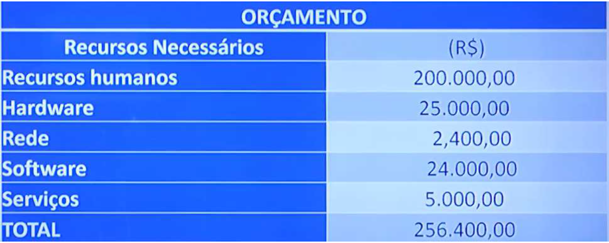

# Especificações do Projeto

Pré-requisitos: <a href="1-Documentação de Contexto.md"> Documentação de Contexto</a>

O cotidiano de muitas pessoas, especialmente de estudantes universitários e moradores de repúblicas, é marcado pela falta de organização na gestão de compras domésticas. A partir deste, o projeto "Compras App" tem como objetivo entender as necessidades dos usuários e mapear como a solução proposta pode atender a essas demandas de forma eficiente. Para isso, serão abordados os seguintes pontos:

### 1. Personas: 
Será criada uma representação dos usuários típicos que utilizarão o "Compras App". O diagrama de personas ajudará a ilustrar as características, necessidades e comportamentos dos usuários, a fim de garantir que o aplicativo seja desenvolvido com foco no seu público-alvo.

### 2. Histórias de Usuários: 
Serão descritas as funcionalidades do aplicativo do ponto de vista dos usuários. As histórias de usuários servirão para mapear as interações que os usuários terão com o sistema, destacando suas necessidades e objetivos.

### 3. Modelagem do Processo de Negócio: 
Descrever e representar de forma visual os processos relacionados à gestão de compras, desde a criação de listas até a execução da compra e o controle de estoque.

### 4. Indicadores de desempenho: 
Avaliar o sucesso do aplicativo e da gestão das compras, com foco em como os usuários estão utilizando a ferramenta e se estão atingindo seus objetivos.

### 5. Requisitos Funcionais: 
Serão listados os requisitos essenciais que o aplicativo deve atender para garantir que os usuários possam atingir seus objetivos de maneira eficiente. Isso incluirá funcionalidades como criar, editar, compartilhar e visualizar listas de compras, além de permitir a organização e a gestão de itens.

### 6. Requisitos Não Funcionais: 
Serão descritos os requisitos relacionados ao desempenho, segurança, usabilidade e confiabilidade do aplicativo. Estes requisitos garantirão que o "Compras App" funcione de maneira otimizada e segura, proporcionando uma experiência satisfatória para o usuário.

### 7. Restrições do Projeto: 
Serão destacadas as limitações ou condições que precisam ser consideradas durante o desenvolvimento do aplicativo, como o uso das tecnologias React Native para o desenvolvimento multiplataforma (Android e iOS), a necessidade de uma interface simples e intuitiva e a compatibilidade com dispositivos de diferentes especificações

### 8. Diagramas de casos de uso: 
Representar as interações entre os usuários e o sistema, identificando as funcionalidades essenciais que o aplicativo deve oferecer.

### 9. Gerenciamento de projeto: 
Planejar e controlar todas as etapas do desenvolvimento do aplicativo, assegurando que o projeto seja concluído dentro do prazo, custo e qualidade desejados.
### Ferramentas:
Trello ou Jira: Ferramentas de gestão de tarefas que permitem a organização de atividades, criação de sprints e acompanhamento do progresso da equipe.
Metodologia Ágil (Scrum ou Kanban): Usada para garantir entregas incrementais e contínuas, com feedback constante.

### 10. Gerenciamento de tempo: 
O gerenciamento de tempo é fundamental para garantir que todas as tarefas do projeto sejam realizadas dentro do prazo estipulado, otimizando a produtividade da equipe e evitando atrasos no desenvolvimento do "Compras App". Para alcançar isso, são utilizadas as seguintes ferramentas e técnicas:
### Ferramentas Utilizadas:
Pomodoro: Técnica que divide o trabalho em intervalos de tempo curtos (geralmente 25 minutos), seguidos de uma pausa curta. Isso ajuda a manter o foco e a evitar a procrastinação.
Time Tracking (Toggl, Harvest): Ferramentas que permitem o rastreamento do tempo gasto em cada tarefa, possibilitando ajustes no planejamento e assegurando que os prazos sejam cumpridos.

### 11. Gerenciamento de equipe: 
Garantir que a equipe de desenvolvimento esteja utilizando seu tempo de forma eficiente e que as atividades sejam concluídas dentro do prazo estipulado.

### 12. Gestão de orçamento: 
Controlar o custo total do desenvolvimento do aplicativo, garantindo que os recursos sejam alocados adequadamente e dentro do orçamento previsto.

## Personas

### Persona 1:
João, o Estudante Universitário Organizado. 22 anos, estudante de Engenharia, mora sozinho em um apartamento, utiliza como tecnlogia: Smartphone Android, Laptop, Apps de produtividade. 

#### Objetivos:
Organizar suas compras de maneira eficiente, evitando desperdícios e mantendo o orçamento controlado.
Controlar o que já possui em casa, para não comprar produtos desnecessários.
Planejar suas compras com antecedência, para garantir que não faltem itens essenciais durante a semana.

#### Frustrações:
Esquece o que tem em casa, acabando por comprar mais do que precisa.
Se sente perdido ao tentar organizar as compras no meio de uma rotina agitada de estudos.
Dificuldade em controlar os gastos mensais, já que o orçamento é apertado.

#### Como o "Compras App" pode ajudar:

O aplicativo permite que ele registre e visualize suas listas de compras e quantidades necessárias.
A funcionalidade de controle de validade ajuda a evitar desperdício de alimentos.
A organização das listas por categorias e o compartilhamento com outros membros da casa facilita a comunicação e o controle.

### Persona 2:
Maria, a moradora de república conectada, 20 anos, estudande de medicina, mora em uma república com 4 colegas, utiliza como tecnnologia: Smartphone iOS, Apps de comunicação (WhatsApp, Facebook), GPS.

#### Objetivos:
Garantir que todas as necessidades da casa sejam atendidas sem causar conflitos entre os colegas de república.
Manter o orçamento compartilhado equilibrado, dividindo as compras de forma justa.
Evitar o acúmulo de produtos, já que a casa tem espaço limitado.

#### Frustrações:
Muitas vezes, os colegas compram os mesmos itens sem saber que outros já compraram.
Há pouca comunicação sobre o que precisa ser comprado, resultando em desperdício de alimentos.
Dificuldade em fazer um controle efetivo do que foi comprado e quem pagou por cada item.

#### Como o "Compras App" pode ajudar:
O aplicativo permite que Maria e seus colegas compartilhem listas de compras em tempo real, evitando compras duplicadas.
O sistema de orçamento compartilhado ajuda a garantir que todos contribuam igualmente para as compras, com um histórico de gastos acessível.
As notificações de validade e estoque ajudam a manter o controle dos itens na casa.

### Persona 3:
Lucas, o Jovem Profissional Empreendedor, 25 anos, Freelancer de Design Gráfico,  Mora sozinho em um pequeno apartamento, tecnologia utilizada: Smartphone Android, Laptop, Apps de produtividade e finanças.

#### Objetivos:
Economizar dinheiro, mantendo um controle rigoroso sobre suas finanças pessoais e evitando desperdícios com compras desnecessárias.
Organizar suas compras de forma prática, já que ele tem pouco tempo livre devido ao trabalho.
Ter uma ferramenta que ajude a planejar as compras para as semanas seguintes, sem perder tempo no supermercado.

#### Frustrações:
Muitas vezes compra itens impulsivamente e se esquece do que já tem em casa.
Sente que seu orçamento é apertado e não sabe como controlar melhor suas despesas com alimentação.
Demora muito para decidir o que comprar e o que está faltando em casa.

#### Como o "Compras App" pode ajudar:
O "Compras App" oferece a função de adicionar itens à lista de compras rapidamente, ajudando Lucas a economizar tempo.
A função de controle de estoque e validade permite que ele tenha um panorama de tudo o que está em casa e o que precisa ser reabastecido.
O aplicativo também pode gerar relatórios de gastos, ajudando Lucas a manter seu orçamento sob controle.

## Histórias de Usuários

#### Histórias de Usuários para Funcionalidades de Listas de Compras
|EU COMO... `PERSONA`| QUERO/PRECISO ... `FUNCIONALIDADE` |PARA ... `MOTIVO/VALOR`                 |
|--------------------|------------------------------------|----------------------------------------|
|João  | Registrar itens em uma lista de compras        | Não esquecer de comprar os itens que preciso e organizar minha compra de forma eficiente               |
|Maria       | Criar uma lista de compras compartilhada              | Dividir as compras com meus colegas de república e garantir que todos saibam o que falta |
|Lucas       | Adicionar rapidamente itens à minha lista de compras                 | Evitar esquecer o que preciso comprar quando estou ocupado |

Apresente aqui as histórias de usuário que são relevantes para o projeto de sua solução. As Histórias de Usuário consistem em uma ferramenta poderosa para a compreensão e elicitação dos requisitos funcionais e não funcionais da sua aplicação. Se possível, agrupe as histórias de usuário por contexto, para facilitar consultas recorrentes à essa parte do documento.

> **Links Úteis**:
> - [Histórias de usuários com exemplos e template](https://www.atlassian.com/br/agile/project-management/user-stories)
> - [Como escrever boas histórias de usuário (User Stories)](https://medium.com/vertice/como-escrever-boas-users-stories-hist%C3%B3rias-de-usu%C3%A1rios-b29c75043fac)
> - [User Stories: requisitos que humanos entendem](https://www.luiztools.com.br/post/user-stories-descricao-de-requisitos-que-humanos-entendem/)
> - [Histórias de Usuários: mais exemplos](https://www.reqview.com/doc/user-stories-example.html)
> - [9 Common User Story Mistakes](https://airfocus.com/blog/user-story-mistakes/)

## Modelagem do Processo de Negócio 

### Análise da Situação Atual

Apresente aqui os problemas existentes que viabilizam sua proposta. Apresente o modelo do sistema como ele funciona hoje. Caso sua proposta seja inovadora e não existam processos claramente definidos, apresente como as tarefas que o seu sistema pretende implementar são executadas atualmente, mesmo que não se utilize tecnologia computacional. 

### Descrição Geral da Proposta

Apresente aqui uma descrição da sua proposta abordando seus limites e suas ligações com as estratégias e objetivos do negócio. Apresente aqui as oportunidades de melhorias.

### Processo 1 – NOME DO PROCESSO

Apresente aqui o nome e as oportunidades de melhorias para o processo 1. Em seguida, apresente o modelo do processo 1, descrito no padrão BPMN. 

### Processo 2 – NOME DO PROCESSO

Apresente aqui o nome e as oportunidades de melhorias para o processo 2. Em seguida, apresente o modelo do processo 2, descrito no padrão BPMN.

## Indicadores de Desempenho

Apresente aqui os principais indicadores de desempenho e algumas metas para o processo. Atenção: as informações necessárias para gerar os indicadores devem estar contempladas no diagrama de classe. Colocar no mínimo 5 indicadores. 

Usar o seguinte modelo: 

Obs.: todas as informações para gerar os indicadores devem estar no diagrama de classe a ser apresentado a posteriori. 

## Requisitos

As tabelas que se seguem apresentam os requisitos funcionais e não funcionais que detalham o escopo do projeto. Para determinar a prioridade de requisitos, aplicar uma técnica de priorização de requisitos e detalhar como a técnica foi aplicada.

### Requisitos Funcionais

|ID    | Descrição do Requisito  | Prioridade |
|------|-----------------------------------------|----|
|RF-001| Permitir que o usuário cadastre tarefas | ALTA | 
|RF-002| Emitir um relatório de tarefas no mês   | MÉDIA |

### Requisitos não Funcionais

|ID     | Descrição do Requisito  |Prioridade |
|-------|-------------------------|----|
|RNF-001| O sistema deve ser responsivo para rodar em um dispositivos móvel | MÉDIA | 
|RNF-002| Deve processar requisições do usuário em no máximo 3s |  BAIXA | 

Com base nas Histórias de Usuário, enumere os requisitos da sua solução. Classifique esses requisitos em dois grupos:

- [Requisitos Funcionais
 (RF)](https://pt.wikipedia.org/wiki/Requisito_funcional):
 correspondem a uma funcionalidade que deve estar presente na
  plataforma (ex: cadastro de usuário).
- [Requisitos Não Funcionais
  (RNF)](https://pt.wikipedia.org/wiki/Requisito_n%C3%A3o_funcional):
  correspondem a uma característica técnica, seja de usabilidade,
  desempenho, confiabilidade, segurança ou outro (ex: suporte a
  dispositivos iOS e Android).
Lembre-se que cada requisito deve corresponder à uma e somente uma
característica alvo da sua solução. Além disso, certifique-se de que
todos os aspectos capturados nas Histórias de Usuário foram cobertos.

## Restrições

O projeto está restrito pelos itens apresentados na tabela a seguir.

|ID| Restrição                                             |
|--|-------------------------------------------------------|
|01| O projeto deverá ser entregue até o final do semestre |
|02| Não pode ser desenvolvido um módulo de backend        |

Enumere as restrições à sua solução. Lembre-se de que as restrições geralmente limitam a solução candidata.

> **Links Úteis**:
> - [O que são Requisitos Funcionais e Requisitos Não Funcionais?](https://codificar.com.br/requisitos-funcionais-nao-funcionais/)
> - [O que são requisitos funcionais e requisitos não funcionais?](https://analisederequisitos.com.br/requisitos-funcionais-e-requisitos-nao-funcionais-o-que-sao/)

## Diagrama de Casos de Uso

O diagrama de casos de uso é o próximo passo após a elicitação de requisitos, que utiliza um modelo gráfico e uma tabela com as descrições sucintas dos casos de uso e dos atores. Ele contempla a fronteira do sistema e o detalhamento dos requisitos funcionais com a indicação dos atores, casos de uso e seus relacionamentos. 

As referências abaixo irão auxiliá-lo na geração do artefato “Diagrama de Casos de Uso”.

> **Links Úteis**:
> - [Criando Casos de Uso](https://www.ibm.com/docs/pt-br/elm/6.0?topic=requirements-creating-use-cases)
> - [Como Criar Diagrama de Caso de Uso: Tutorial Passo a Passo](https://gitmind.com/pt/fazer-diagrama-de-caso-uso.html/)
> - [Lucidchart](https://www.lucidchart.com/)
> - [Astah](https://astah.net/)
> - [Diagrams](https://app.diagrams.net/)

# Matriz de Rastreabilidade

A matriz de rastreabilidade é uma ferramenta usada para facilitar a visualização dos relacionamento entre requisitos e outros artefatos ou objetos, permitindo a rastreabilidade entre os requisitos e os objetivos de negócio. 

A matriz deve contemplar todos os elementos relevantes que fazem parte do sistema, conforme a figura meramente ilustrativa apresentada a seguir.

> **Links Úteis**:
> - [Artigo Engenharia de Software 13 - Rastreabilidade](https://www.devmedia.com.br/artigo-engenharia-de-software-13-rastreabilidade/12822/)
> - [Verificação da rastreabilidade de requisitos usando a integração do IBM Rational RequisitePro e do IBM ClearQuest Test Manager](https://developer.ibm.com/br/tutorials/requirementstraceabilityverificationusingrrpandcctm/)
> - [IBM Engineering Lifecycle Optimization – Publishing](https://www.ibm.com/br-pt/products/engineering-lifecycle-optimization/publishing/)

# Gerenciamento de Projeto

De acordo com o PMBoK v6 as dez áreas que constituem os pilares para gerenciar projetos, e que caracterizam a multidisciplinaridade envolvida, são: Integração, Escopo, Cronograma (Tempo), Custos, Qualidade, Recursos, Comunicações, Riscos, Aquisições, Partes Interessadas. Para desenvolver projetos um profissional deve se preocupar em gerenciar todas essas dez áreas. Elas se complementam e se relacionam, de tal forma que não se deve apenas examinar uma área de forma estanque. É preciso considerar, por exemplo, que as áreas de Escopo, Cronograma e Custos estão muito relacionadas. Assim, se eu amplio o escopo de um projeto eu posso afetar seu cronograma e seus custos.

## Gerenciamento de Tempo

Com diagramas bem organizados que permitem gerenciar o tempo nos projetos, o gerente de projetos agenda e coordena tarefas dentro de um projeto para estimar o tempo necessário de conclusão.

O gráfico de Gantt ou diagrama de Gantt também é uma ferramenta visual utilizada para controlar e gerenciar o cronograma de atividades de um projeto. Com ele, é possível listar tudo que precisa ser feito para colocar o projeto em prática, dividir em atividades e estimar o tempo necessário para executá-las.

## Gerenciamento de Equipe

O gerenciamento adequado de tarefas contribuirá para que o projeto alcance altos níveis de produtividade. Por isso, é fundamental que ocorra a gestão de tarefas e de pessoas, de modo que os times envolvidos no projeto possam ser facilmente gerenciados. 

## Gestão de Orçamento

O processo de determinar o orçamento do projeto é uma tarefa que depende, além dos produtos (saídas) dos processos anteriores do gerenciamento de custos, também de produtos oferecidos por outros processos de gerenciamento, como o escopo e o tempo.

