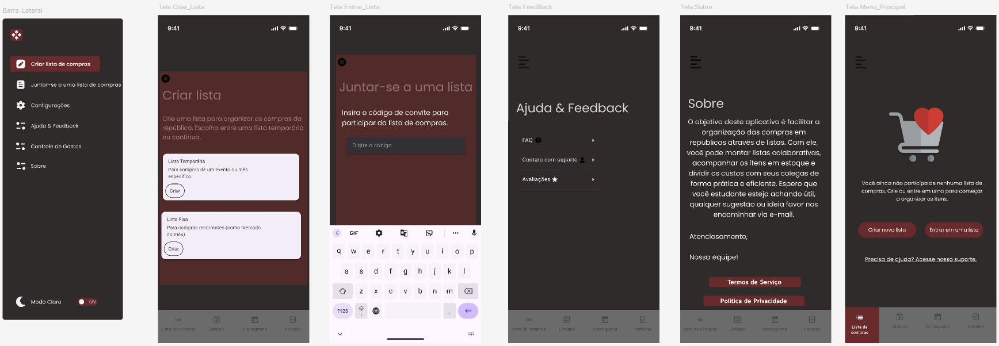
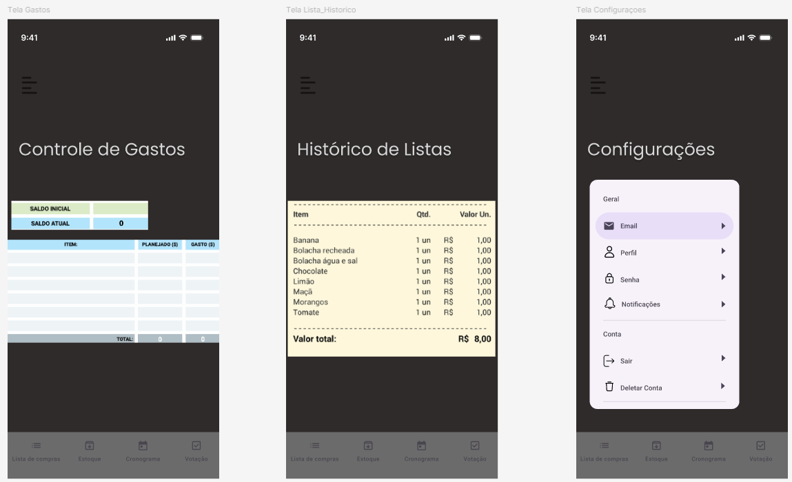

# Projeto de Interface

Pré-requisitos: <a href="02-Especificação do Projeto.md"> Especificações do Projeto</a>

Visão geral da interação do usuário pelas telas do sistema e protótipo interativo das telas com as funcionalidades que fazem parte do sistema (wireframes).

## Diagrama de Fluxo

## Wireframes

São protótipos usados em design de interface para sugerir a estrutura de um site web e seu relacionamentos entre suas páginas. Um wireframe web é uma ilustração semelhante do layout de elementos fundamentais na interface.

 
 
 
 
 
 
 
 
 
 
 
 
