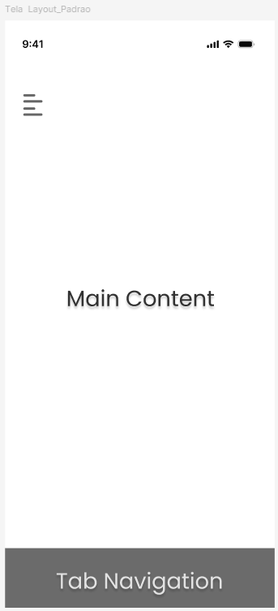

# Template Padrão da Aplicação

Pré-requisitos: <a href="02-Especificação do Projeto.md"> Especificações do Projeto</a>, <a href="03-Metodologia.md"> Metodologia</a>, <a href="04-Projeto de Interface.md"> Projeto de Interface</a>

## Identidade Visual

**Cores de Fundo:**

* Background (padrão): #A82223 e #231F20

**Cores de Texto:**

* Cor de fonte (padrão): #fff e #000 
* Cor do texto com underline: #FFA726

## Responsividade 

O design foi pensado com base em princípios de responsividade. A ideia foi organizar os elementos de forma que, eles possam se adaptar bem a diferentes tamanhos de tela, para dispositivos móveis.

À vista disso, os componentes foram distribuídos de forma clara e espaçada, priorizando a leitura e a navegação simples. Assim, o layout poderá ser ajustado com facilidade para diferentes resoluções em dispositivos iOS e Android.

## Tipografia 

* Fonte do Título: Roboto
* Fonte do Texto: Roboto
  
## Iconografia

A aplicação fará uso de uma variedade de ícones com o objetivo de aprimorar tanto a usabilidade quanto a estética.

Dessa forma, para assegurar consistência visual e facilitar a implementação, serão utilizados ícones de bibliotecas ou sites.

## Exemplo de Layout Padrão

