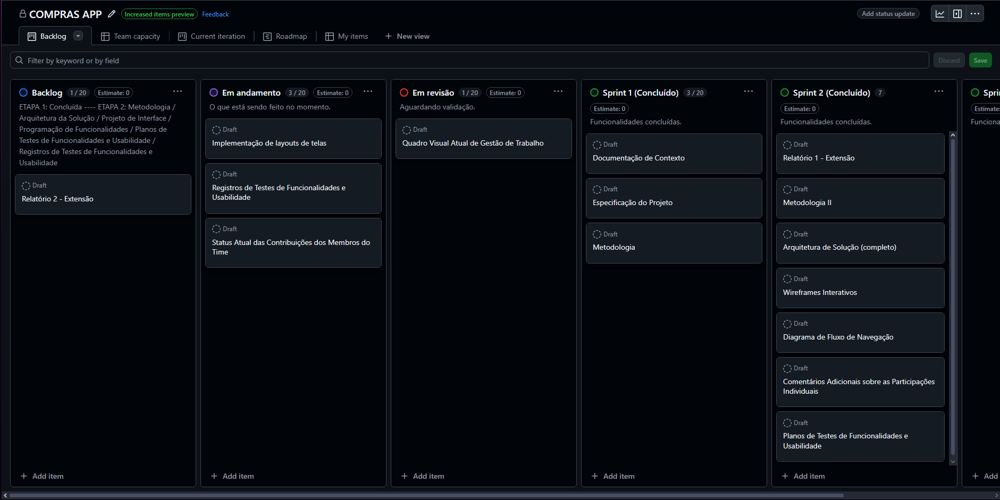
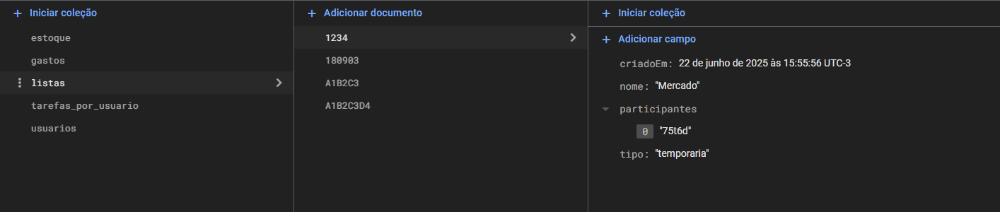

# Programação de Funcionalidades

Pré-requisitos: <a href="02-Especificação do Projeto.md"> Especificação do Projeto</a>, <a href="03-Metodologia.md"> Metodologia</a>, <a href="04-Projeto de Interface.md"> Projeto de Interface</a>, <a href="05-Arquitetura da Solução.md"> Arquitetura da Solução</a>

## Implementação de Layouts de Telas

### Desenvolvimento de Wireframes

O Wireframe foi desenvolvido utilizando o Figma: [Tá na Lista!](https://www.figma.com/design/NlQGLKGaC0UFdYNKh72Lt1/T%C3%A1-na-Lista-?node-id=0-1&t=FrJ0wrSeIfKir5gg-1)

### Implementação de Layouts

Os Layouts foram implementados utilizando React Native e o código fonte pode ser acessado pelo [link](https://github.com/ICEI-PUCMinas-PSG-SI-TI/psg-ads-n-tiam-2025-1-n-compras-app/tree/main/src).

## Quadro Visual Atual de Gestão de Trabalho no GitHub

### Atribuição de Responsabilidades e Acompanhamento de Progresso

Atribuição de Responsabilidades - Camila Machado
  
> - Projeto de Interface (Diagrama de Fluxo de Navegação e Wireframes Interativos)
> - Implementação das telas

Atribuição de Responsabilidades - Edrei Dornelas

> - Programação de Funcionalidades
> - Implementação das telas
  
Atribuição de Responsabilidades - Giordano Sa

> - Arquitetura de Solução (Requisitos e Restrições; Modelo ER, Esquema Relacional e Padronização de Qualidade de Produto)
> - Implementação das telas
> - Registro de Testes 
  
Atribuição de Responsabilidades - Leonardo Mendes

> - Metodologia (Tecnologias, Ferramentas, Controle de Versão e Gerenciamento de Projeto)
> - Implementação das telas

Atribuição de Responsabilidades - Marcio Lucas

> - Planos de Testes de Software
> - Implementação das telas

Atribuição de Responsabilidades - Tarsis Augustus

> - Projeto de Interface (Wireframes Interativos)
> - Implementação das telas

### Sprint 2

### Sprint 3

## Status Atual das Contribuições dos Membros do Time no GitHub

## Comentários Adicionais sobre as Participações Individuais

**Avaliação de Desempenho**

**Camila:**

> - Comprometimento na criação de layouts e wireframes.
> - Dedicação ao valor visual e nas funcionalidades, mesmo sob prazos reduzidos.
> - Boa comunicação e colaboração dentro da equipe.
> - Atenção aos detalhes e habilidade na resolução de problemas.

**Edrei:**

> - Competência no desenvolvimento de software.
> - Trouxe soluções práticas.
> - Comprometido com a qualidade em todas as etapas, mesmo com desafios.
> - Colaboração dentro da equipe, disposto a ajudar.

**Giordano:**

> - Conseguiu trazer boas ideias ao projeto.
> - Contribuiu para melhorar a experiência do usuário, apesar das restrições de tempo.
> - Participou de forma colaborativa, apoiando a equipe.
> - Postura proativa, assumindo responsabilidades.

**Leonardo:**

> - Comprometimento diante das tarefas.
> - Gerenciou prazos com eficácia.
> - Participou das discussões, com sugestões construtivas.
> - Iniciativa em propor melhorias no projeto.

**Marcio:**

> - Domínio técnico e versatilidade no desenvolvimento de funcionalidades.
> - Calma e eficiência.
> - Assumiu tarefas com responsabilidade e entregou com qualidade.
> - Colaboração dentro da equipe, disposto a ajudar.

**Tarsis:**

> - Criatividade e precisão na elaboração dos wireframes.
> - Equilibrou bem design e usabilidade, contribuindo para a experiência do usuário.
> - Participou ativamente das discussões, com sugestões construtivas.
> - Confiança e comprometimento mesmo sob várias demandas.

## Padrões de Projeto de Codificação

O aplicativo Tá Na Lista! possui boa organização e adoção de vários padrões de codificação recomendados, o que facilita a manutenção e a escalabilidade.

| Padrões                              | Situação | Observação                                                   |
|--------------------------------------|----------|--------------------------------------------------------------|
| **Nomenclatura clara**               | Sim      | Nomes explicativos                                           |
| **Arquivos com nomes coerentes**     | Sim      | Como Telas nomeadas como `TelaInicial.tsx`, `Login.tsx`, etc |
| **Indentação**                       | Sim      | Código bem identado e legível                                |
| **Organização modular**              | Sim      | Separação por telas e responsabilidades                      |
| **Validação de entradas**            | Sim      | Campos obrigatórios validados antes de envio                 |
| **Boas práticas com hooks**          | Sim      | Uso correto do `useState`, `useEffect`, etc                  |
| **Tratamento de erros**              | Sim      | Uso do `try/catch` e `Alert`                                 |
| **Estilização com StyleSheet**       | Sim      | Padrão adotado em todas as telas com `StyleSheet.create`     |

## Autenticação

**Evidências de Implementação da Autenticação. A aplicação utiliza o Firebase Authentication para gerenciar o login dos usuários.**

* A autenticação foi implementada com e-mail e senha.
* O Firebase gerencia os usuários e vincula automaticamente o UID à coleção usuarios.
  

## Estrutura do Banco de Dados (Firebase Firestore)

Abaixo estão as coleções e documentos utilizados no Firestore Database, com as capturas de tela e estrutura de dados.

### Firestore Database 

A estrutura do banco segue o modelo NoSQL orientado a documentos, com coleções independentes para organização de dados.

### Collection: `estoque`

Armazena os itens disponíveis, classificados por categoria, nome e quantidade.

### Collection: `gastos`

Registra os gastos estimados e realizados por usuário.

### Collection: `listas`

Armazena as listas de compras com data de criação, tipo e participantes.

### Collection: `tarefas_por_usuario`

Armazena tarefas organizadas por usuário. Cada usuário possui uma subcoleção de tarefas.

### Collection: `usuarios`

Contém os dados cadastrais de cada usuário vinculado ao UID do Firebase Authentication.

