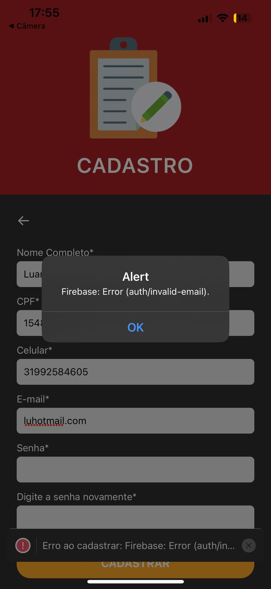
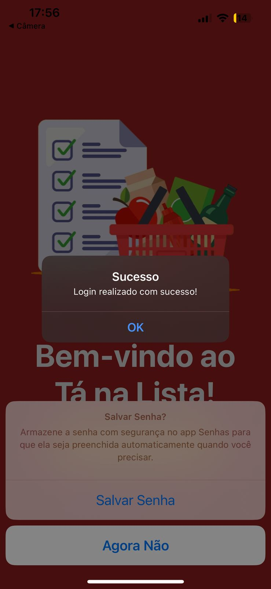
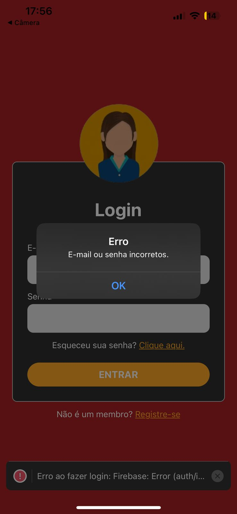

# Registro de Testes de Software

Pré-requisitos: <a href="04-Projeto de Interface.md"> Projeto de Interface</a>, <a href="08-Plano de Testes de Software.md"> Plano de Testes de Software</a>

Esta documentação tem como objetivo apresentar uma visão clara da confiabilidade e estabilidade das funcionalidades de cadastro e login do Tá na Lista!, a princípio. A seguir, estão os objetivos, resultados esperados, observações e a conclusão geral dos registros de testes.

# Cadastro / Login

## Teste de Cadastro

### Objetivo 

Verificar se um usuário pode se cadastrar com sucesso ao fornecer todas as informações necessárias.

### Resultado Esperado 

O usuário é cadastrado com sucesso e redirecionado para a página inicial para efetuar login.

### Observação 

A senha está bloqueada, porque os screenshots não são permitidos por motivos de segurança.

  
  

### Conclusão

Após a realização do teste, foi concluído com sucesso o cadastro do usuário, pois as credencias fornecidas estavam corretas. O sistema gera um alerta de confirmação e redireciona o usuário para a página inicial, ou seja, os resultados indicam que a funcionalidade de cadastro está operando conforme o esperado, o que proporciona uma excelente experiência aos usuários.

## Teste de Cadastro com E-mail Inválido

### Objetivo 

Verificar se o aplicativo Tá na Lista! valida corretamente o formato do endereço de e-mail.

### Resultado Esperado

O aplicativo exibe uma mensagem de erro, pois o formato é inválido e, assim, não permite o cadastro.

  

### Conclusão

Após a realização do teste, foi identificado que a funcionalidade para formatação incorreta de e-mail funciona conforme esperado e exibe um alerta ao usuário. Entretanto, o alerta é genérico e não fornece a mensagem de erro específica para esse caso. Dessa forma, esse resultado mostra a necessidade de uma melhoria na experiência do usuário. 

## Teste de Login

### Objetivo 

Se um usuário pode fazer login com sucesso ao fornecer credenciais válidas.

### Resultado Esperado 

O usuário é autenticado com sucesso e redirecionado para o menu principal do aplicativo.

### Observação 

O menu principal está sendo finalizado, no momento para este teste o usuário é redirecionado para a página inicial. 

  
  

### Conclusão

O teste confirmou que a funcionalidade de login opera conforme o esperado, permitindo o acesso com credenciais válidas e redirecionando corretamente o usuário para a tela de menu principal.

## Teste de Login com Credenciais Inválidas

### Objetivo 

Testar se o sistema reconhece e responde corretamente a dados de login inválidos.

### Resultado Esperado 

O aplicativo informa que os dados inseridos são inválidos e impede o acesso à conta.

  

### Conclusão

A tentativa de acesso com senha incorreta foi corretamente impedida pelo sistema, que apresentou uma notificação de erro apropriada. Esses resultados demonstram que o processo de autenticação responde de maneira eficaz a credenciais inválidas.
