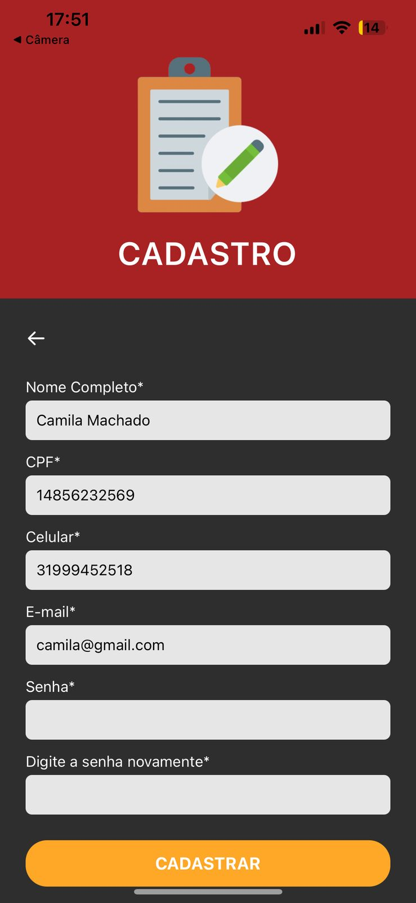
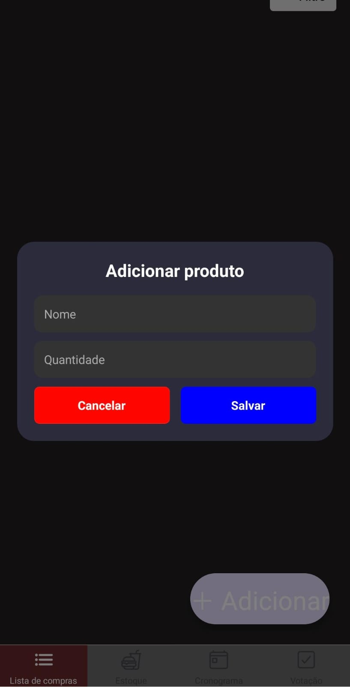
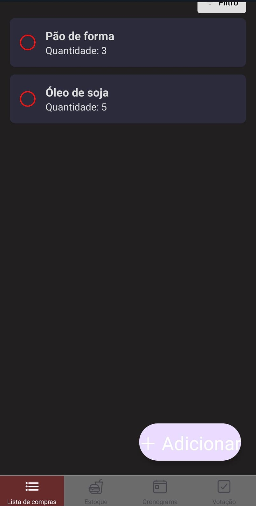

# Registro de Testes de Usabilidade

Esta documentação tem como objetivo apresentar uma avaliação detalhada da usabilidade das funcionalidades de cadastro e login do aplicativo Tá na Lista!, com foco na eficácia e na facilidade de uso desses recursos, proporcionando uma experiência de usuário eficiente e intuitiva.

## Teste de Cadastro

### Objetivo 

Verificar se um usuário pode se cadastrar com praticidade.

### Observação

A senha está bloqueada, porque os screenshots não são permitidos por motivos de segurança.

  
  

### Conclusão

Os testes de usabilidade mostraram que o processo de cadastro foi concluído, em média, em 1 minuto, evidenciando uma experiência rápida e intuitiva. Recomenda-se o monitoramento contínuo para manter a eficiência e identificar possíveis melhorias.

## Teste de Login

### Objetivo 

Avaliar se um usuário pode fazer login com praticidade.

### Observação

O menu principal está sendo finalizado. No momento, para este teste, o usuário é redirecionado para a página inicial. 

  
  

### Conclusão

Os testes de usabilidade confirmaram que o processo de login é simples, rápido e eficaz, proporcionando uma experiência de acesso intuitiva e sem complicações.

## Teste de Adição de itens

### Objetivo 

Verificar se um usuário pode adicionar um item à sua lista

### Observação

  
  

### Conclusão

Os testes de usabilidade mostraram que o processo de adição foi concluído com rapidez e praticidade. 

